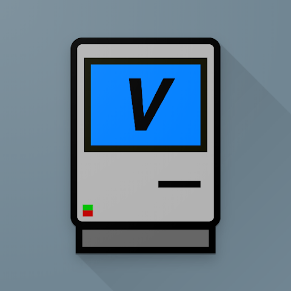

# Mac II (minivmac)

### Description

Mini vMac is an emulator for the Macintosh Plus, a computer sold by Apple from 1984 to 1996.

### License

GPLv2

### Icon

### Fanart

Help make me fanart!

### Screenshots

Help make me screenshots!
